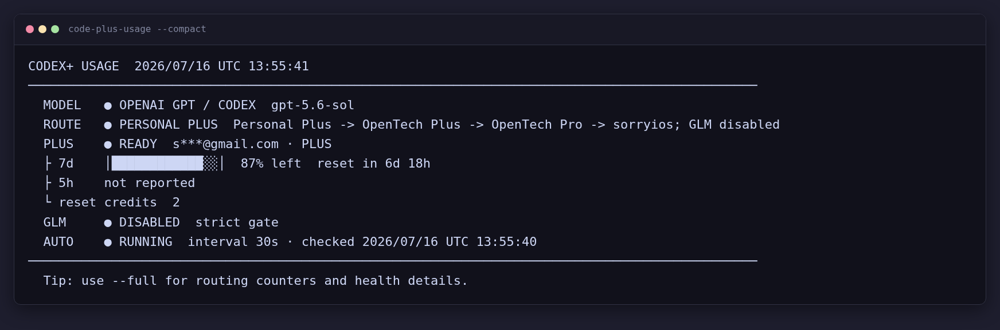

# Codex Plus-first Gateway

> 用一个本地 CLIProxyAPI，让 Codex 默认优先使用个人 ChatGPT Plus、失败后按顺序回退多个中转，并提供默认硬关闭、只能显式开启的 GLM-5.2/fast 挡位与额度仪表盘。

_A local Codex gateway that prefers your ChatGPT Plus account, falls back across relays, and keeps GLM hard-disabled until you explicitly switch it on._



这是一个面向 Linux 的小型配置与运维工具，不是 CLIProxyAPI 的 fork。仓库提供一份可复现部署文档和一个终端脚本，
让 Codex CLI、Codex App 与 IDE 共用本机账号池、路由挡位和配额状态。

## 能做什么

- GPT 默认链路：个人 ChatGPT Plus OAuth → OpenTech Plus → OpenTech Pro → sorryios。
- GLM 硬门控：GPT 挡位下 `tai-glm disabled=true`，代理不注册 `glm-5.2` 或 `glm-5.2-fast`。
- 显式切换：一个命令同时修改 Codex 默认模型和代理侧 GLM 开关。
- 终端仪表盘：查看默认模型、路由状态、Plus 配额、reset credits、上游计数和后台协调器。
- 配额恢复：仅在真实额度耗尽时选择最早到期的 Full reset；健康额度只清理本地陈旧冷却状态。
- 安全边界：代理和管理面板只监听 `127.0.0.1`，密钥不进入仓库和命令行参数。

## 快速开始

要求：Linux、Node.js 18+、Codex CLI/App，以及你本人拥有或获准使用的 ChatGPT 和中转服务。

```bash
git clone https://github.com/szddddddd/cliproxyapi-codex-plus-first-guide.git
cd cliproxyapi-codex-plus-first-guide
```

接着按[完整配置与技术文档](docs/CONFIGURATION.md)完成以下步骤：

1. 安装 CLIProxyAPI，并创建相互隔离的本地 client key 与 management key。
2. 写入完整 `config.yaml`，配置 Plus OAuth、多级 GPT 回退和默认关闭的 GLM provider。
3. 完成 ChatGPT Plus 设备代码登录。
4. 在 `~/.codex/config.toml` 中添加 `PlusFirst` provider，并保留已有项目与功能设置。
5. 安装仪表盘脚本并验证默认模型目录不包含 GLM。

安装仓库脚本：

```bash
install -m 700 bin/codex-plus-usage /root/.local/bin/codex-plus-usage
ln -sfn codex-plus-usage /root/.local/bin/code-plus-usage

node --check /root/.local/bin/codex-plus-usage
code-plus-usage --self-test
code-plus-usage --compact --read-only
```

### 让 Agent 帮你配置

把下面这段提示交给 Codex 或其他本机 coding agent：

```text
请先完整阅读 docs/CONFIGURATION.md，再配置 Codex Plus-first Gateway。
开始前审计并备份已有的 ~/.codex/config.toml、CLIProxyAPI 配置和 shell 启动项；
保留无关设置，不输出或提交任何 API Key/OAuth token；使用独立本地 client key；
默认保持 GPT 挡位和 tai-glm disabled=true；完成后运行文档中的自测、模型目录与权限检查。
```

Agent 仍需要你亲自提供授权范围内的上游服务，并在浏览器完成 ChatGPT 设备代码登录。

## 挡位切换

```bash
code-plus-usage --switch=gpt       # 默认：禁用 GLM，使用 GPT 多级路由
code-plus-usage --switch=glm       # 显式启用 glm-5.2
code-plus-usage --switch=glm-fast  # 显式启用 glm-5.2-fast
```

切换命令会同时更新：

- `~/.codex/config.toml` 顶层 `model`
- CLIProxyAPI `openai-compatibility[name=tai-glm].disabled`

不要只运行 `codex -m glm-5.2` 来开启 GLM；代理硬门控关闭时，单改客户端模型不会生效。切换后请新建任务；
若 Codex App 的模型列表仍是旧状态，完整重启 App。

## 常用命令

```bash
code-plus-usage                  # 完整面板
code-plus-usage --compact        # 单屏面板
code-plus-usage --watch=30       # 每 30 秒刷新
code-plus-usage --json --read-only
code-plus-usage --daemon --interval=30
```

`--daemon` 会启用额度状态修复和 Full reset 协调逻辑；部署前请阅读技术文档中的策略、状态文件和回滚说明。

## 文档

- [完整配置、机器改动清单、启动、验证与回滚](docs/CONFIGURATION.md)
- [仪表盘脚本](bin/codex-plus-usage)
- [CLIProxyAPI](https://github.com/router-for-me/CLIProxyAPI)
- [OpenAI Codex](https://github.com/openai/codex)

## 已验证环境

- CLIProxyAPI `v7.2.77`
- Codex CLI `0.144.4`
- Node.js `22.22.3`（脚本要求 Node.js 18+）
- Linux/SSH 集群，PID 1 为 `sshd`

不同版本可能改变配置字段或模型目录行为。升级前请备份，并重新验证 GPT 回退顺序、GLM 硬门控与 OAuth 状态。
