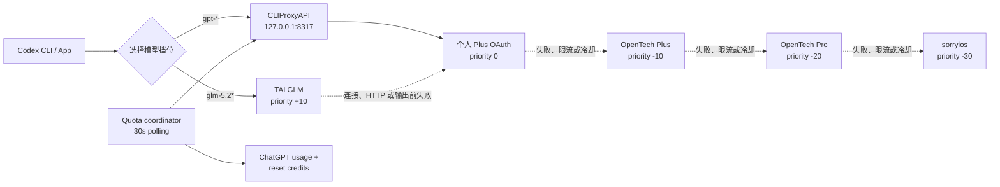

# CLIProxyAPI 配置 Codex：GPT Plus / GLM 双挡位与多上游回退

这是一份经过实际部署验证的配置记录，目标是让 Codex CLI 和桌面 App 统一连接本机
[CLIProxyAPI](https://github.com/router-for-me/CLIProxyAPI)，并提供两条并列、可手动选择的模型路径：

1. GPT 挡位：个人 ChatGPT Plus OAuth → OpenTech Plus → OpenTech Pro → sorryios
2. GLM 挡位：自部署 `glm-5.2` / `glm-5.2-fast` → 个人 ChatGPT Plus

本文以 Linux、root 用户和 CLIProxyAPI `v7.2.77` 为例。路径可按实际用户调整。
公开模板将本地客户端密钥与上游中转站密钥分离；这比直接复用已有中转密钥更安全，且不改变路由顺序。

> [!IMPORTANT]
> CLIProxyAPI 不能按“Plus 剩余 5%”主动切换。它按凭据优先级和运行状态选择线路；只有当前凭据出现额度耗尽、429、上游失败或进入冷却状态时，才会尝试下一条凭据。

> [!WARNING]
> 仅添加你本人拥有或获准使用的 ChatGPT 账号和中转服务。不要公开设备代码、OAuth JSON、API Key 或管理密钥。

> [!NOTE]
> GLM 是独立模型家族，不是 GPT。这里的“并列挡位”表示用户先选择模型家族；GLM 凭据使用更高的内部优先级，是为了在 GLM 挡位先调用 GLM，失败后才由 GPT Plus 接管。

## 架构与实际行为



关键行为：

- `routing.strategy: fill-first` 优先使用当前可用的最高优先级凭据。
- 请求 `gpt-*` 时进入 GPT 路径；请求 `glm-5.2*` 时进入 GLM 路径，不会随机混用模型家族。
- GLM 路径中 TAI 为 `+10`，个人 Plus 为 `0`；TAI 在产生输出前失败时，CLIProxyAPI 会改用 `gpt-5.6-sol`。
- 一旦 GLM 已经产生部分输出，代理无法在同一响应中无缝改成 GPT；长时间无响应也依赖下游请求超时，不能保证即时切换。
- 在已验证版本中，没有显式设置优先级的 Codex OAuth 凭据默认优先级为 `0`。
- 将中转站优先级设为负数，即可让个人 OAuth 排在中转站之前。
- `request-retry` 和 `max-retry-credentials` 控制失败后的重试与候选凭据数量。
- 高优先级凭据从冷却状态恢复后，会重新具备被选择的资格。
- ChatGPT 上游额度恢复后，协调器会清除 CLIProxyAPI 遗留的本地 `error/quota/cooldown` 状态。
- 额度真正耗尽时，协调器只选择 `status=available` 的 Full reset，并按 `expires_at` 从早到晚兑换。
- 这不是按余额百分比调度，也不是精确的成本优化器。

## 1. 安装官方 CLIProxyAPI

下面以 `v7.2.77`、Linux amd64 为例。其他架构请从
[Releases](https://github.com/router-for-me/CLIProxyAPI/releases) 选择对应文件。

```bash
VERSION=7.2.77
cd /tmp

curl -fLO "https://github.com/router-for-me/CLIProxyAPI/releases/download/v${VERSION}/CLIProxyAPI_${VERSION}_linux_amd64.tar.gz"
curl -fLO "https://github.com/router-for-me/CLIProxyAPI/releases/download/v${VERSION}/checksums.txt"

sha256sum -c checksums.txt --ignore-missing
tar -xzf "CLIProxyAPI_${VERSION}_linux_amd64.tar.gz"
install -m 755 cli-proxy-api /usr/local/bin/cliproxyapi
```

创建运行目录：

```bash
install -d -m 700 /root/.config/cliproxyapi
install -d -m 700 /root/.local/share/cliproxyapi/auths
install -d -m 700 /root/.local/bin
```

确认版本。CLIProxyAPI 会在启动日志开头输出版本、commit 和构建时间：

```bash
/usr/local/bin/cliproxyapi -help 2>&1 | head
```

## 2. 准备本地客户端密钥和管理密钥

建议将“Codex CLI 访问本地 CLIProxyAPI 的密钥”和“上游中转站 API Key”分开，不要复用。

```bash
umask 077
printf 'local-%s\n' "$(openssl rand -hex 32)" > /root/.config/cliproxyapi/client.key
openssl rand -hex 32 > /root/.config/cliproxyapi/management.key
chmod 600 /root/.config/cliproxyapi/client.key
chmod 600 /root/.config/cliproxyapi/management.key
```

后续配置中的以下占位符需要在部署机器上替换：

| 占位符 | 含义 |
|---|---|
| `<LOCAL_CLIENT_KEY>` | `/root/.config/cliproxyapi/client.key` 的内容 |
| `<MANAGEMENT_KEY>` | `/root/.config/cliproxyapi/management.key` 的内容 |
| `<OPENTECH_PLUS_KEY>` | OpenTech Codex Plus Pool API Key |
| `<OPENTECH_PRO_KEY>` | OpenTech Codex Pro Pool API Key |
| `<SORRYIOS_KEY>` | sorryios 备用 API Key，可选 |
| `<TAI_GLM_KEY>` | TAI GLM OpenAI-compatible Bearer token |
| `<OUTBOUND_PROXY_URL>` | 集群访问外网所需的 HTTP/SOCKS 代理；不需要时填空字符串 |

不要把替换后的真实运行配置提交到 Git。

## 3. 创建 CLIProxyAPI 配置

创建 `/root/.config/cliproxyapi/config.yaml`：

```yaml
host: "127.0.0.1"
port: 8317

tls:
  enable: false

remote-management:
  allow-remote: false
  secret-key: "<MANAGEMENT_KEY>"
  disable-control-panel: false

auth-dir: "/root/.local/share/cliproxyapi/auths"

# Codex CLI 访问本地代理时使用的密钥，不是上游中转站密钥。
api-keys:
  - "<LOCAL_CLIENT_KEY>"

debug: false
logging-to-file: false
usage-statistics-enabled: true

# 不需要出站代理时改成空字符串：proxy-url: ""
proxy-url: "<OUTBOUND_PROXY_URL>"

request-retry: 3
max-retry-credentials: 4
max-retry-interval: 30
disable-cooling: false
save-cooldown-status: true

routing:
  strategy: "fill-first"
  session-affinity: false

codex-api-key:
  - api-key: "<OPENTECH_PLUS_KEY>"
    priority: -10
    base-url: "https://api.opentech.top"
    websockets: false

  - api-key: "<OPENTECH_PRO_KEY>"
    priority: -20
    base-url: "https://api.opentech.top"
    websockets: false

  # 可选的最低优先级备用线路。
  # 不使用 sorryios 时删除整个条目，不要保留空 key。
  - api-key: "<SORRYIOS_KEY>"
    priority: -30
    base-url: "https://sorryios.ai/codex"
    websockets: false

openai-compatibility:
  - name: "tai-glm"
    priority: 10
    base-url: "https://gateway.ai.cloudflare.com/v1/<ACCOUNT_ID>/default/custom-tai/v1"
    api-key-entries:
      - api-key: "<TAI_GLM_KEY>"
    models:
      - name: "glm-5.2"
        alias: "glm-5.2"
        display-name: "GLM-5.2 (non-GPT)"
        input-modalities: [text]
        output-modalities: [text]
      - name: "glm-5.2-fast"
        alias: "glm-5.2-fast"
        display-name: "GLM-5.2 Fast (non-GPT)"
        input-modalities: [text]
        output-modalities: [text]

# 保留 gpt-5.6-sol，同时让个人 Plus 支持两个 GLM 客户端别名。
# 只有实际选中的 GLM 上游失败时，调度器才会使用这两个映射。
oauth-model-alias:
  codex:
    - name: "gpt-5.6-sol"
      alias: "glm-5.2"
      fork: true
    - name: "gpt-5.6-sol"
      alias: "glm-5.2-fast"
      fork: true
```

Cloudflare 网关根地址通常以 `.../custom-tai` 结束，完整补全地址以
`.../custom-tai/v1/chat/completions` 结束。CLIProxyAPI 会自行追加 `/chat/completions`，
所以 `openai-compatibility.base-url` 必须填到 `.../custom-tai/v1`，不能填完整补全 URL，
也不能漏掉 `/v1`。

保护配置文件：

```bash
chmod 600 /root/.config/cliproxyapi/config.yaml
```

第一次正常启动时，CLIProxyAPI 会把 `remote-management.secret-key` 的明文值替换为 bcrypt 哈希。
因此必须另外保留权限为 `600` 的 `management.key`，供管理面板登录使用。

如果不需要管理面板，可以使用更小的攻击面：

```yaml
remote-management:
  allow-remote: false
  secret-key: ""
  disable-control-panel: true
```

但这样也会关闭 `/v0/management` 管理接口，并使本文的自动状态恢复和 Full reset 协调器无法工作。

## 4. 登录个人 ChatGPT Plus

先在 [ChatGPT 安全设置](https://chatgpt.com/#settings/Security) 中启用 Codex 设备代码授权，然后运行：

```bash
/usr/local/bin/cliproxyapi \
  -config /root/.config/cliproxyapi/config.yaml \
  -codex-device-login
```

按照终端显示的设备代码完成授权。OAuth 凭据会写入：

```text
/root/.local/share/cliproxyapi/auths/
```

授权文件应保持 `600` 权限，不要复制到仓库、聊天记录或工单中。

如果网页提示“无法授权此设备”：

1. 确认设备代码授权已经在 ChatGPT 安全设置中启用。
2. 重新运行 `-codex-device-login`，生成新的设备代码。
3. 只输入当前终端显示的代码；旧代码和过期代码不能继续使用。
4. 不要分享设备代码。

启用安全设置本身不会让已经失败或过期的设备代码恢复有效，因此通常需要重新运行登录命令。

### 多个 ChatGPT 账号

每个账号分别执行一次设备代码登录，并确认认证目录中生成了独立 JSON 文件。多个 OAuth 凭据具有相同优先级时，具体选择还会受到调度策略和凭据状态影响。

## 5. 启动 CLIProxyAPI

前台验证：

```bash
/usr/local/bin/cliproxyapi \
  -config /root/.config/cliproxyapi/config.yaml
```

日志应显示：

- 服务监听 `127.0.0.1:8317`
- OAuth 和三条 Codex API Key 凭据均已载入
- Management API 已注册（仅在配置管理密钥时）

### systemd 环境

在 systemd 是 PID 1 的常规 Linux 机器上，可创建 `/etc/systemd/system/cliproxyapi.service`：

```ini
[Unit]
Description=CLIProxyAPI Plus-first Codex gateway
Wants=network-online.target
After=network-online.target

[Service]
Type=simple
User=root
Group=root
WorkingDirectory=/root/.config/cliproxyapi
ExecStart=/usr/local/bin/cliproxyapi -config /root/.config/cliproxyapi/config.yaml
Restart=on-failure
RestartSec=3
UMask=0077

[Install]
WantedBy=multi-user.target
```

```bash
systemctl daemon-reload
systemctl enable --now cliproxyapi
systemctl status cliproxyapi
```

### PID 1 不是 systemd 的集群或容器

如果 `ps -p 1 -o comm=` 显示 `sshd`、`bash` 或容器入口程序，systemd unit 不会真正接管进程。
可以先用 `nohup`：

```bash
nohup /usr/local/bin/cliproxyapi \
  -config /root/.config/cliproxyapi/config.yaml \
  > /root/.local/share/cliproxyapi/cliproxyapi.log 2>&1 </dev/null &

echo $! > /root/.local/share/cliproxyapi/cliproxyapi.pid
chmod 600 /root/.local/share/cliproxyapi/cliproxyapi.pid
```

也可以在 SSH shell 启动脚本中加入“进程不存在才启动”的检查：

```bash
if command -v cliproxyapi >/dev/null 2>&1 && ! pgrep -x cliproxyapi >/dev/null 2>&1; then
    env -u OPENAI_BASE_URL -u OPENAI_API_KEY -u CODEX_API_KEY \
        nohup /usr/local/bin/cliproxyapi \
        -config /root/.config/cliproxyapi/config.yaml \
        > /root/.local/share/cliproxyapi/cliproxyapi.log 2>&1 </dev/null &
    echo $! > /root/.local/share/cliproxyapi/cliproxyapi.pid
    chmod 600 /root/.local/share/cliproxyapi/cliproxyapi.pid
fi
```

这只是登录时自动补启动，不是完整的进程监督器。如果代理在没有新 SSH 登录时退出，它不会自动重启。

## 6. 让 Codex CLI 使用本地账号池

创建只读取本地客户端密钥的辅助命令 `/root/.local/bin/codex-cliproxy-token`：

```sh
#!/bin/sh
set -eu
exec cat /root/.config/cliproxyapi/client.key
```

```bash
chmod 700 /root/.local/bin/codex-cliproxy-token
```

在现有 `/root/.codex/config.toml` 中保留原来的模型、项目和功能配置，只添加本地 provider，并将它设为默认：

```toml
model_provider = "PlusFirst"

[model_providers.PlusFirst]
name = "Plus-first CLIProxyAPI"
base_url = "http://127.0.0.1:8317/v1"
wire_api = "responses"
supports_websockets = false

[model_providers.PlusFirst.auth]
command = "/root/.local/bin/codex-cliproxy-token"
timeout_ms = 5000
refresh_interval_ms = 0
```

顶层 `model` 决定新会话的默认挡位。单次 CLI 会话可以直接覆盖：

```bash
codex -m gpt-5.6-sol
codex -m glm-5.2
codex -m glm-5.2-fast
```

安装第 8 节的面板脚本后，也可以持久修改顶层 `model`，不会改 provider、reasoning effort 或项目配置：

```bash
code-plus-usage --switch=gpt
code-plus-usage --switch=glm
code-plus-usage --switch=glm-fast
```

这只影响之后新建的 CLI / App 会话。已经打开的 Codex App 任务保留自己的模型，
应在模型选择器中切换或新建任务。

### Codex App 会不会出现 GLM 按钮？

Codex App 没有为任意自定义 provider 自动生成永久“快捷按钮”的承诺；它使用 composer 下方的模型选择器，
内容来自 app-server 的 `model/list`。在 Codex CLI `0.144.4` 与 CLIProxyAPI `v7.2.77` 的实测组合中，
`glm-5.2` 和 `glm-5.2-fast` 会进入 `model/list`，所以完整重启 App 后可以成为可选条目。

但当前 CLIProxyAPI 在“GLM 主路由 + GPT 跨 provider 回退”共用同一个模型别名时，会把目录展示元数据合并成
GPT fallback 的名称，实测两个 GLM ID 的 `displayName` 都可能显示为 `GPT 5.6 Sol`。
因此它不是可靠、清晰的 GLM 可视化按钮。本文不启用静态 `model_catalog_json` 去覆盖目录，因为那会冻结模型列表，
妨碍 GPT 新模型自动出现；终端面板和 `--switch` 以实际模型 ID 为准，并明确标注 `NON-GPT`。

修改前先备份：

```bash
cp -a /root/.codex/config.toml \
  "/root/.codex/config.toml.pre-cliproxy-$(date +%Y%m%d-%H%M%S)"
```

不要覆盖与代理无关的字段，例如当前模型、reasoning effort、项目 trust level 或其他功能开关。

### 保留原中转站手动回退

如果原 Codex 配置中已经存在直接访问 OpenTech 的 provider，请保留该 provider。需要绕过本地 CLIProxyAPI 时，临时把：

```toml
model_provider = "PlusFirst"
```

改回原 provider 名称即可。自动账号池回退发生在 CLIProxyAPI 内部；直接 provider 只用于 CLIProxyAPI 本身停止时的人工应急。

## 7. 验证主链路

先验证进程和模型列表：

```bash
pgrep -af '^/usr/local/bin/cliproxyapi '

LOCAL_KEY=$(cat /root/.config/cliproxyapi/client.key)
curl --http1.1 --noproxy '*' -fsS \
  -H "Authorization: Bearer ${LOCAL_KEY}" \
  http://127.0.0.1:8317/v1/models
```

查看日志：

```bash
tail -f /root/.local/share/cliproxyapi/cliproxyapi.log
```

推荐分别验证四种凭据，但不要把 API Key 写进命令历史或测试输出。验证内容至少包括：

- 个人 OAuth 能完成一次最小 Codex 请求
- OpenTech Plus Pool 能独立返回成功
- OpenTech Pro Pool 能独立返回成功
- sorryios 可用时能独立返回成功
- Plus Pool 故障或冷却时，请求能继续尝试 Pro Pool

`GET /v1/models` 只能证明本地服务和认证正常，不能完整证明每条上游生成链路都可用。

## 8. 查看 Plus、GLM 和中转使用情况

### 安装终端仪表盘和额度协调器

仓库中的 [`bin/codex-plus-usage`](bin/codex-plus-usage) 需要 Node.js 18 或更高版本：

```bash
install -m 700 bin/codex-plus-usage /root/.local/bin/codex-plus-usage
ln -sfn codex-plus-usage /root/.local/bin/code-plus-usage

node --check /root/.local/bin/codex-plus-usage
/root/.local/bin/codex-plus-usage --self-test
```

单次查看和持续刷新：

```bash
code-plus-usage
code-plus-usage --watch
code-plus-usage --watch=30
```

切换新会话默认模型：

```bash
code-plus-usage --switch=gpt       # gpt-5.6-sol
code-plus-usage --switch=glm       # glm-5.2，非 GPT
code-plus-usage --switch=glm-fast  # glm-5.2-fast，非 GPT
```

界面显示：

- 新会话默认挡位、实际模型 ID，以及 GPT / GLM `NON-GPT` 家族标识
- GLM provider 的本机成功/失败计数和 GLM → Plus 回退规则
- TAI 状态页中 `glm-5.2`、`glm-5.2-fast` 的模型列表与补全监控状态
- Plus 本地认证状态和 ChatGPT 上游可用状态
- 5 小时、7 天等额度窗口、已用/剩余百分比和重置时间
- Full reset 数量及最早到期时间
- 个人 OAuth、OpenTech Plus/Pro、sorryios 的本机成功/失败计数
- 后台协调器运行状态、最后检查、最后动作和错误

TAI 状态页标注约 10 分钟更新一次，不是单次请求的实时探针；本机 GLM 成功/失败计数来自 CLIProxyAPI，
两者应结合判断。面板不会输出 GLM token、OAuth token、中转 key 或 reset credit ID。

启动后台协调器：

```bash
NODE_BIN=$(command -v node)
nohup "$NODE_BIN" /root/.local/bin/codex-plus-usage \
  --daemon --interval=30 \
  > /root/.local/share/cliproxyapi/plus-quota-coordinator.log \
  2>&1 </dev/null &
```

在 SSH 集群中，可将下面的检查放到 Node.js 初始化之后的 `~/.zshrc`；常规服务器应优先交给 systemd、supervisord 或集群进程管理器：

```bash
_pid_file=/root/.local/share/cliproxyapi/plus-quota-coordinator.pid
_pid=$(tr -d '\n' < "$_pid_file" 2>/dev/null || true)
if [ -z "$_pid" ] || ! kill -0 "$_pid" 2>/dev/null; then
    NODE_BIN=$(command -v node)
    nohup "$NODE_BIN" /root/.local/bin/codex-plus-usage \
      --daemon --interval=30 \
      > /root/.local/share/cliproxyapi/plus-quota-coordinator.log \
      2>&1 </dev/null &
fi
unset _pid_file _pid NODE_BIN
```

协调器会自己维护以下权限为 `600` 的文件：

```text
/root/.local/share/cliproxyapi/plus-quota-coordinator.pid
/root/.local/share/cliproxyapi/plus-quota-coordinator.json
/root/.local/share/cliproxyapi/plus-quota-coordinator.log
```

自动策略严格限制为：

1. 上游额度健康但 CLIProxyAPI 仍是旧 `error` 时，只清理本地状态，不消耗 credit。
2. 只有上游明确 `limit_reached=true`、`allowed=false` 或窗口达到 100% 时才考虑 Full reset。
3. 获取详细 credit 列表，只保留 `available` 项，并选择最早 `expires_at`。
4. 兑换前保存 credit ID 和幂等请求 ID；网络重试复用同一请求 ID，避免重复消耗。
5. 兑换成功后调用 CLIProxyAPI `/reset-quota`，让个人 OAuth 立即恢复最高优先级。
6. 上游只返回 credit 数量、没有到期详情或详情列表不完整时，自动兑换会停止，不猜测顺序。

`--read-only` 可以完全关闭单次命令中的状态修复与兑换；`--json` 输出已经脱敏，不包含 OAuth token、API Key 或 reset credit ID。

### 官方管理面板

CLIProxyAPI 的官方管理面板由
[Cli-Proxy-API-Management-Center](https://github.com/router-for-me/Cli-Proxy-API-Management-Center)
提供，当前配置中的地址是：

```text
http://127.0.0.1:8317/management.html
```

服务只监听服务器回环地址。需要从自己的电脑建立 SSH 隧道：

```bash
ssh -p <SSH_PORT> -N \
  -L 8317:127.0.0.1:8317 \
  <USER>@<CLUSTER_HOST>
```

然后在本地浏览器打开：

```text
http://127.0.0.1:8317/management.html
```

输入 `/root/.config/cliproxyapi/management.key` 中保存的管理密钥。不要将 `8317` 直接映射到公网。

管理面板不只是只读仪表盘，它也能修改配置和认证文件。只向可信用户提供管理密钥，使用完关闭 SSH 隧道。

### Management API

有管理密钥时，可查询：

```text
GET /v0/management/auth-files
GET /v0/management/api-key-usage
POST /v0/management/api-call
POST /v0/management/reset-quota
```

其中：

- `auth-files` 提供 OAuth 凭据状态、成功/失败次数、冷却状态和最近请求桶。
- `api-key-usage` 提供各 API Key 凭据的本机成功/失败次数和最近请求桶。
- `api-call` 可让管理面板代表某个 OAuth 凭据查询上游配额。
- `reset-quota` 只清理 CLIProxyAPI 本地额度/冷却状态，不会消耗 ChatGPT Full reset credit。

这些原始接口可能返回账号标识或包含 API Key 的组合键。不要直接把原始 JSON 粘贴到公开位置，展示前必须过滤和脱敏。

### 统计边界

- ChatGPT Plus 配额通常以 5 小时、7 天等窗口百分比表示，但上游可能只返回其中一个窗口。
- 如果 `secondary_window` 为 `null`，应显示“上游未返回”，不要自行估算。
- 配额查询不是稳定的公开 OpenAI API，字段和行为可能变化。
- `api-key-usage` 是 CLIProxyAPI 本机路由计数，不是 OpenTech 或 sorryios 的余额、账单或套餐剩余额度。
- 本机计数保存在内存中，CLIProxyAPI 重启后会归零。
- 当前官方 README 说明内置面板不提供持久化用量数据库。需要长期 token、费用和模型维度分析时，应部署独立统计服务，例如官方 README 提到的 CPA Usage Keeper 或 CPA-Manager-Plus。

## 9. 安全检查

公开或提交任何文档前，至少检查：

```bash
rg -n --hidden \
  'Bearer |cfut_[A-Za-z0-9]+|sk-[A-Za-z0-9]{20,}|api[_-]?key|access_token|refresh_token|management.key|client.key' \
  .
```

安全基线：

- CLIProxyAPI 绑定 `127.0.0.1`，不绑定 `0.0.0.0`。
- `remote-management.allow-remote` 保持 `false`。
- 使用 SSH 隧道访问面板，不公开代理端口。
- OAuth JSON、运行配置和密钥文件权限为 `600`。
- 认证目录和配置目录权限为 `700`。
- 上游 API Key、OAuth token、设备代码和管理密钥不进入 Git。
- 如果 API Key 曾出现在聊天记录、终端录屏或公开日志中，立即轮换。
- 不在进程命令行参数中放置 OAuth access token。
- 协调器状态文件可能暂存不透明的 reset credit ID 和幂等 ID，必须保持 `600`，不得提交到 Git。

## 10. 常见问题

### 为什么个人 Plus 还没到剩余 5% 就切换了？

CLIProxyAPI 不理解“剩余 5%”这个业务阈值。只要个人 OAuth 被判定为不可用、限流、模型不可用或进入冷却，它就可能立即回退到中转站。

### 为什么剩余已经低于 5% 仍然没有切换？

因为调度器不读取该百分比作为选择条件。只要个人 OAuth 仍被认为可用，它仍保持最高优先级。

### 为什么看不到 5 小时窗口？

上游配额响应可能只提供 7 天窗口，另一个窗口可能为 `null`。这不代表监控脚本计算错误。

### 为什么中转站统计重启后变成 0？

原生成功/失败与最近请求统计是内存状态，不是持久化账本。

### Full reset 后已经 100% left，为什么仍在调用中转站？

ChatGPT 上游额度和 CLIProxyAPI 本地调度状态是两层状态。Full reset 会恢复上游额度，但 CLIProxyAPI 可能仍保留重置前的 `usage_limit_reached` 错误，导致个人 OAuth 继续被跳过。

协调器会比较这两层状态：当上游返回 `allowed=true`、`limit_reached=false`，且本地仍保留明确的 quota/rate-limit 错误时，自动调用 `/v0/management/reset-quota` 清除旧状态。该接口也会同步清理持久化 `.cds` 冷却记录。可以用下面的命令立即触发一次检查：

```bash
code-plus-usage
```

### 自动 Full reset 会使用哪一个 credit？

只在额度真实耗尽时，从详细列表中筛选 `available` credit，并使用最早到期的一个。这个排序与当前 Codex TUI 的选择逻辑一致；没有到期详情时不会盲目兑换。

### OpenTech Plus Pool 不稳定怎么办？

保持 Plus Pool 为 `-10`、Pro Pool 为 `-20`，并让冷却和跨凭据重试生效。先直接验证 Pro Pool 的 key 和 base URL 可用，再判断是 Plus Pool 波动、集群出站代理问题还是 CLIProxyAPI 配置问题。

### GLM 挡位什么时候会自动切换到 Plus？

已验证的原生行为是：GLM 发生连接错误、HTTP 错误，或在尚未产生输出时失败，CLIProxyAPI 会继续选择较低优先级的个人 Plus，
并把客户端模型别名映射到 `gpt-5.6-sol`。GLM 已经输出一部分内容后不能无缝换模型；纯粹长时间挂起也要等请求上下文超时，
因此“自动切换”不是任意故障下的即时抢占。

### 为什么选择 GLM 后响应里的 model 是 gpt-5.6-sol？

这表示本次 GLM 请求触发了预期回退，最终回答来自个人 Plus，而不是伪装成 GLM。`code-plus-usage` 会把 GLM 失败计数和个人 Plus 成功计数分开显示。

### `glm-5.2-fast` 在模型列表里，为什么仍然不能调用？

模型目录只表示 provider 声明了这个模型，不保证当前有可用生成渠道。应同时检查 TAI 状态页的 Completion 监控和一次最小生成请求。
如果 fast 返回上游故障，当前配置会自动尝试个人 Plus。

### systemctl 为什么无法启动服务？

先检查：

```bash
ps -p 1 -o pid,comm,args
```

PID 1 不是 systemd 时，unit 文件即使存在也不会提供真正的服务监督。应使用容器编排器、supervisord、s6、集群提供的进程管理器，或临时使用 `nohup`。

## 11. 回滚

停止 CLIProxyAPI：

```bash
pkill -TERM -x cliproxyapi
pkill -TERM -f 'codex-plus-usage --daemon'
```

恢复 Codex 配置备份：

```bash
cp -a /root/.codex/config.toml.pre-cliproxy-<TIMESTAMP> \
  /root/.codex/config.toml
```

或者仅把 `model_provider` 改回原来的直接中转 provider。CLIProxyAPI 配置和 OAuth 文件可以暂时保留，不会在进程停止后继续接管 Codex 请求。

## 参考

- [router-for-me/CLIProxyAPI](https://github.com/router-for-me/CLIProxyAPI)
- [CLIProxyAPI Management API](https://help.router-for.me/cn/management/api)
- [Cli-Proxy-API-Management-Center](https://github.com/router-for-me/Cli-Proxy-API-Management-Center)
- [OpenAI Codex](https://github.com/openai/codex)

## 验证范围

本方法在以下组合中完成过实际验证：

- CLIProxyAPI `v7.2.77`
- Codex CLI 使用 Responses wire API
- 一个个人 ChatGPT Plus OAuth 凭据
- OpenTech Codex Plus Pool 与 Pro Pool
- TAI OpenAI-compatible `glm-5.2` 成功请求
- `glm-5.2-fast` 上游不可用时自动回退到个人 Plus
- Codex app-server `model/list` 能看到两个 GLM ID，并复现跨 provider 别名的 displayName 合并限制
- 一个低优先级 sorryios 备用入口
- SSH 集群，PID 1 为 `sshd`，通过 `nohup` 维持代理进程
- 本地管理面板仅通过 SSH tunnel 访问
- Full reset 后遗留的本地 `usage_limit_reached` 状态自动恢复
- 2 个带到期时间的 Full reset credit，最早到期项选择策略通过自测
- `code-plus-usage` GPT / GLM 终端仪表盘、持久挡位切换与 30 秒后台协调器

不同版本的 CLIProxyAPI、Codex CLI 和上游中转服务可能改变字段或行为。升级前应先备份配置，并在独立终端验证个人 OAuth、每条中转线路和回退顺序。
