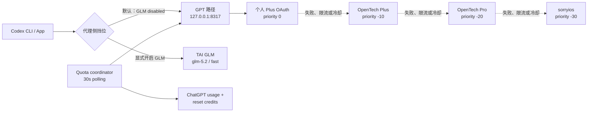
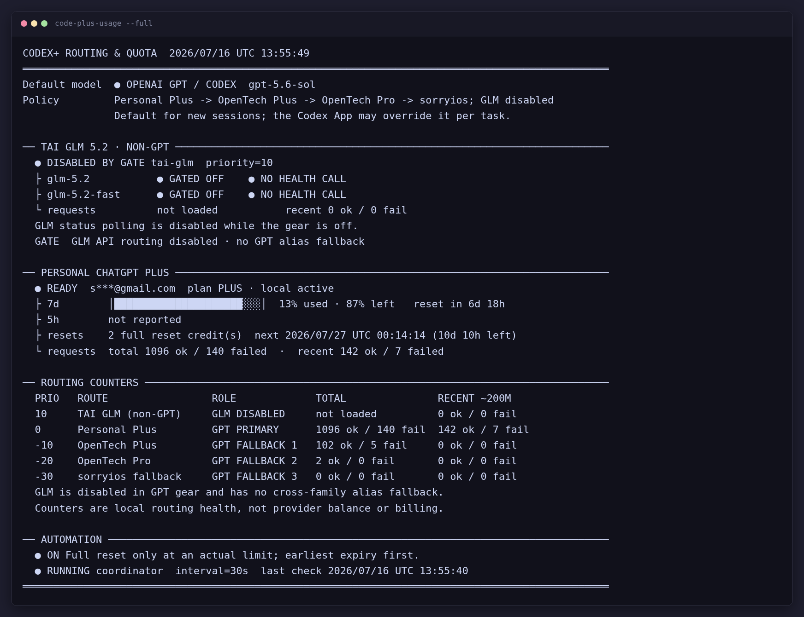

# 完整技术文档：CLIProxyAPI + Codex Plus-first Gateway

[返回项目首页](../README.md)

本文是一份可直接执行的部署与运维文档，覆盖 CLIProxyAPI、Codex、自定义 provider、GPT 多上游回退、GLM
硬门控、终端仪表盘、额度协调器、启动方式、安全权限、验证和回滚。除明确标注为“当前机器审计”的内容外，命令均以
全新 Linux/root 环境为目标；非 root 用户可把 `/root` 替换为自己的 `$HOME`。

## 部署后会修改什么

| 路径 | 操作 | 建议权限 | 作用 |
|---|---|---:|---|
| `/usr/local/bin/cliproxyapi` | 新增 | `755` | 本地 OpenAI-compatible 代理 |
| `/root/.config/cliproxyapi/config.yaml` | 新增 | `600` | 上游、优先级、重试和 GLM 门控 |
| `/root/.config/cliproxyapi/client.key` | 新增 | `600` | Codex 访问本地代理的专用密钥 |
| `/root/.config/cliproxyapi/management.key` | 新增 | `600` | 本地 Management API/面板登录密钥 |
| `/root/.local/share/cliproxyapi/auths/` | 新增 | 目录 `700`、文件 `600` | ChatGPT Plus OAuth 凭据 |
| `/root/.local/bin/codex-cliproxy-token` | 新增 | `700` | 只向 Codex 输出本地客户端密钥 |
| `/root/.local/bin/codex-plus-usage` | 新增 | `700` | 仪表盘、挡位切换和额度协调器 |
| `/root/.local/bin/code-plus-usage` | 符号链接 | — | 较短的命令别名 |
| `/root/.codex/config.toml` | 增量修改 | `600` | 将 `PlusFirst` 设为 Codex provider，GPT 为默认模型 |
| `/root/.codex/relay.config.toml` | 可选新增 | `600` | 绕过本地代理的人工应急 profile |
| `/root/.local/share/cliproxyapi/` | 新增运行文件 | 目录 `700`、文件 `600` | 日志、PID、协调器状态 |
| `/etc/systemd/system/cliproxyapi.service` | 可选新增 | `644` | systemd 主机上的服务监督 |
| `/root/.zshrc` | 非 systemd 环境增量修改 | 保持原权限 | 登录时补启动代理和协调器 |

服务只监听 `127.0.0.1:8317`。部署不需要开放公网端口，也不应把 OAuth JSON、API Key 或管理密钥写入仓库。

### 当前机器审计与推荐方案的差异

2026-07-16 对当前机器完成过逐项审计，实际运行状态如下：

- PID 1 是 `sshd`，所以虽然存在 systemd unit，真正生效的是 `/root/.zshrc` 中的 `nohup` 补启动逻辑。
- 当前本地 token helper 是 `/root/.local/bin/codex-plus-first-token`，它读取 `/root/.codex/auth.json` 中的
  `OPENAI_API_KEY`；当前 `config.yaml` 也保留了两个历史本地 client key。
- 当前机器没有 `/root/.config/cliproxyapi/client.key`。这是历史部署差异，新机器应使用本文推荐的独立
  `client.key` 和 `codex-cliproxy-token`，避免复用上游或 Codex 已有密钥。
- CLIProxyAPI 为 `v7.2.77`；Node.js 使用 `/root/.nvm/versions/node/v22.22.3/bin/node`；协调器每 30 秒运行一次。
- `tai-glm` 当前为 `disabled: true`，没有 GLM OAuth 同名别名；GPT 挡位下两个 GLM ID 不进入模型目录。

不要把上述“当前机器差异”原样复制到新环境。它用于解释本机发生过哪些修改；从零部署请按正文的隔离密钥方案执行。

## 前置条件

- Linux 主机，具备 root 或等价 sudo 权限；示例使用 amd64。
- Codex CLI/App 已安装，Node.js 18 或更高版本可用。
- `curl`、`openssl`、`jq`、`rg`、`sha256sum` 和常规 POSIX shell 工具。
- 一个你本人拥有的 ChatGPT Plus 账号，以及需要接入的中转 API Key。
- 使用 GLM 挡位时需要 TAI GLM OpenAI-compatible token；不使用 GLM 时可省略 provider，但不要运行依赖该 provider 的 `--switch` 命令。
- 如果集群不能直接访问外网，需要一个可用的 HTTP/SOCKS 出站代理地址。

执行前先备份已有的 `~/.codex/config.toml`、shell rc 和 CLIProxyAPI 配置。本文所有 `<PLACEHOLDER>` 都必须替换，
但替换后的真实文件不得提交 Git。

这是一份经过实际部署验证的配置记录，目标是让 Codex CLI 和桌面 App 统一连接本机
[CLIProxyAPI](https://github.com/router-for-me/CLIProxyAPI)，并提供两条并列、可手动选择的模型路径：

1. GPT 默认挡位：个人 ChatGPT Plus OAuth → OpenTech Plus → OpenTech Pro → sorryios
2. GLM 手动挡位：只在显式开启后调用自部署 `glm-5.2` / `glm-5.2-fast`

本文以 Linux、root 用户和 CLIProxyAPI `v7.2.77` 为例。路径可按实际用户调整。
公开模板将本地客户端密钥与上游中转站密钥分离；这比直接复用已有中转密钥更安全，且不改变路由顺序。

> [!IMPORTANT]
> CLIProxyAPI 不能按“Plus 剩余 5%”主动切换。它按凭据优先级和运行状态选择线路；只有当前凭据出现额度耗尽、429、上游失败或进入冷却状态时，才会尝试下一条凭据。

> [!WARNING]
> 仅添加你本人拥有或获准使用的 ChatGPT 账号和中转服务。不要公开设备代码、OAuth JSON、API Key 或管理密钥。

> [!NOTE]
> GLM 是独立模型家族，不是 GPT。默认配置把 `tai-glm` provider 设为 `disabled: true`；仅切换模型名不会绕过这个代理侧门控。只有运行明确的 GLM 挡位切换命令后，provider 才会被启用。

## 架构与实际行为



关键行为：

- `routing.strategy: fill-first` 优先使用当前可用的最高优先级凭据。
- GPT 挡位会把 `tai-glm` 写成 `disabled: true`。此时 GLM 凭据不会注册到路由器，`glm-5.2*` 也不会出现在代理模型列表中。
- GLM 挡位会先把 provider 改成 `disabled: false`，再把 Codex 默认模型切到 `glm-5.2` 或 `glm-5.2-fast`。
- 配置不创建 GLM → GPT 的 `oauth-model-alias`。因此 GLM 关闭时请求 `glm-*` 会失败，而不是悄悄改用 GPT；GLM 开启后，上游失败也不会跨模型家族回退。
- `priority: 10` 只在 provider 已启用且请求模型匹配时生效，不能越过 `disabled: true`。
- provider 出现在 YAML 中或密钥被加载到配置文件，不等于调用 API；真正的生成请求只有在 GLM 门控开启后才可路由。
- 在已验证版本中，没有显式设置优先级的 Codex OAuth 凭据默认优先级为 `0`。
- 将中转站优先级设为负数，即可让个人 OAuth 排在中转站之前。
- `request-retry` 和 `max-retry-credentials` 控制失败后的重试与候选凭据数量。
- 高优先级凭据从冷却状态恢复后，会重新具备被选择的资格。
- ChatGPT 上游额度恢复后，协调器会清除 CLIProxyAPI 遗留的本地 `error/quota/cooldown` 状态。
- 额度真正耗尽时，协调器只选择 `status=available` 的 Full reset，并按 `expires_at` 从早到晚兑换。
- 这不是按余额百分比调度，也不是精确的成本优化器。

## 1. 安装官方 CLIProxyAPI

下面以 `v7.2.77`、Linux amd64 为例。其他架构请从
[Releases](https://github.com/router-for-me/CLIProxyAPI/releases) 选择对应文件。

```bash
VERSION=7.2.77
cd /tmp

curl -fLO "https://github.com/router-for-me/CLIProxyAPI/releases/download/v${VERSION}/CLIProxyAPI_${VERSION}_linux_amd64.tar.gz"
curl -fLO "https://github.com/router-for-me/CLIProxyAPI/releases/download/v${VERSION}/checksums.txt"

sha256sum -c checksums.txt --ignore-missing
tar -xzf "CLIProxyAPI_${VERSION}_linux_amd64.tar.gz"
install -m 755 cli-proxy-api /usr/local/bin/cliproxyapi
```

创建运行目录：

```bash
install -d -m 700 /root/.config/cliproxyapi
install -d -m 700 /root/.local/share/cliproxyapi/auths
install -d -m 700 /root/.local/bin
```

确认版本。CLIProxyAPI 会在启动日志开头输出版本、commit 和构建时间：

```bash
/usr/local/bin/cliproxyapi -help 2>&1 | head
```

## 2. 准备本地客户端密钥和管理密钥

建议将“Codex CLI 访问本地 CLIProxyAPI 的密钥”和“上游中转站 API Key”分开，不要复用。

```bash
umask 077
printf 'local-%s\n' "$(openssl rand -hex 32)" > /root/.config/cliproxyapi/client.key
openssl rand -hex 32 > /root/.config/cliproxyapi/management.key
chmod 600 /root/.config/cliproxyapi/client.key
chmod 600 /root/.config/cliproxyapi/management.key
```

后续配置中的以下占位符需要在部署机器上替换：

| 占位符 | 含义 |
|---|---|
| `<LOCAL_CLIENT_KEY>` | `/root/.config/cliproxyapi/client.key` 的内容 |
| `<MANAGEMENT_KEY>` | `/root/.config/cliproxyapi/management.key` 的内容 |
| `<OPENTECH_PLUS_KEY>` | OpenTech Codex Plus Pool API Key |
| `<OPENTECH_PRO_KEY>` | OpenTech Codex Pro Pool API Key |
| `<SORRYIOS_KEY>` | sorryios 备用 API Key，可选 |
| `<TAI_GLM_KEY>` | TAI GLM OpenAI-compatible Bearer token |
| `<OUTBOUND_PROXY_URL>` | 集群访问外网所需的 HTTP/SOCKS 代理；不需要时填空字符串 |

不要把替换后的真实运行配置提交到 Git。

## 3. 创建 CLIProxyAPI 配置

创建 `/root/.config/cliproxyapi/config.yaml`：

```yaml
host: "127.0.0.1"
port: 8317

tls:
  enable: false

remote-management:
  allow-remote: false
  secret-key: "<MANAGEMENT_KEY>"
  disable-control-panel: false

auth-dir: "/root/.local/share/cliproxyapi/auths"

# Codex CLI 访问本地代理时使用的密钥，不是上游中转站密钥。
api-keys:
  - "<LOCAL_CLIENT_KEY>"

debug: false
logging-to-file: false
usage-statistics-enabled: true

# 不需要出站代理时改成空字符串：proxy-url: ""
proxy-url: "<OUTBOUND_PROXY_URL>"

request-retry: 3
max-retry-credentials: 4
max-retry-interval: 30
disable-cooling: false
save-cooldown-status: true

routing:
  strategy: "fill-first"
  session-affinity: false

codex-api-key:
  - api-key: "<OPENTECH_PLUS_KEY>"
    priority: -10
    base-url: "https://api.opentech.top"
    websockets: false

  - api-key: "<OPENTECH_PRO_KEY>"
    priority: -20
    base-url: "https://api.opentech.top"
    websockets: false

  # 可选的最低优先级备用线路。
  # 不使用 sorryios 时删除整个条目，不要保留空 key。
  - api-key: "<SORRYIOS_KEY>"
    priority: -30
    base-url: "https://sorryios.ai/codex"
    websockets: false

openai-compatibility:
  - name: "tai-glm"
    # 默认硬关闭；只允许切换脚本把它改成 false。
    disabled: true
    priority: 10
    base-url: "https://gateway.ai.cloudflare.com/v1/<ACCOUNT_ID>/default/custom-tai/v1"
    api-key-entries:
      - api-key: "<TAI_GLM_KEY>"
    models:
      - name: "glm-5.2"
        alias: "glm-5.2"
        display-name: "GLM-5.2 (non-GPT)"
        input-modalities: [text]
        output-modalities: [text]
      - name: "glm-5.2-fast"
        alias: "glm-5.2-fast"
        display-name: "GLM-5.2 Fast (non-GPT)"
        input-modalities: [text]
        output-modalities: [text]

# 不要为 glm-5.2 / glm-5.2-fast 添加 oauth-model-alias。
# 否则 GLM 关闭或故障时可能由 GPT 接管，破坏严格挡位语义。
```

Cloudflare 网关根地址通常以 `.../custom-tai` 结束，完整补全地址以
`.../custom-tai/v1/chat/completions` 结束。CLIProxyAPI 会自行追加 `/chat/completions`，
所以 `openai-compatibility.base-url` 必须填到 `.../custom-tai/v1`，不能填完整补全 URL，
也不能漏掉 `/v1`。

`disabled` 是 CLIProxyAPI `v7.2.77` 的原生 provider 开关。服务会热加载配置；切回 GPT 后，新的请求无法再选择 GLM。
正在进行中的 GLM 流可能已经到达上游，若需要立即中断并同时清零内存计数，应重启 CLIProxyAPI。

保护配置文件：

```bash
chmod 600 /root/.config/cliproxyapi/config.yaml
```

第一次正常启动时，CLIProxyAPI 会把 `remote-management.secret-key` 的明文值替换为 bcrypt 哈希。
因此必须另外保留权限为 `600` 的 `management.key`，供管理面板登录使用。

如果不需要管理面板，可以使用更小的攻击面：

```yaml
remote-management:
  allow-remote: false
  secret-key: ""
  disable-control-panel: true
```

但这样也会关闭 `/v0/management` 管理接口，并使本文的自动状态恢复和 Full reset 协调器无法工作。

## 4. 登录个人 ChatGPT Plus

先在 [ChatGPT 安全设置](https://chatgpt.com/#settings/Security) 中启用 Codex 设备代码授权，然后运行：

```bash
/usr/local/bin/cliproxyapi \
  -config /root/.config/cliproxyapi/config.yaml \
  -codex-device-login
```

按照终端显示的设备代码完成授权。OAuth 凭据会写入：

```text
/root/.local/share/cliproxyapi/auths/
```

授权文件应保持 `600` 权限，不要复制到仓库、聊天记录或工单中。

如果网页提示“无法授权此设备”：

1. 确认设备代码授权已经在 ChatGPT 安全设置中启用。
2. 重新运行 `-codex-device-login`，生成新的设备代码。
3. 只输入当前终端显示的代码；旧代码和过期代码不能继续使用。
4. 不要分享设备代码。

启用安全设置本身不会让已经失败或过期的设备代码恢复有效，因此通常需要重新运行登录命令。

### 多个 ChatGPT 账号

每个账号分别执行一次设备代码登录，并确认认证目录中生成了独立 JSON 文件。多个 OAuth 凭据具有相同优先级时，具体选择还会受到调度策略和凭据状态影响。

## 5. 启动 CLIProxyAPI

前台验证：

```bash
/usr/local/bin/cliproxyapi \
  -config /root/.config/cliproxyapi/config.yaml
```

日志应显示：

- 服务监听 `127.0.0.1:8317`
- OAuth 和三条 Codex API Key 凭据均已载入
- Management API 已注册（仅在配置管理密钥时）

### systemd 环境

在 systemd 是 PID 1 的常规 Linux 机器上，可创建 `/etc/systemd/system/cliproxyapi.service`。
如果需要通过出站代理访问上游 API，同时避免本地回环地址走代理，应配置 `Environment=` 并包含 `NO_PROXY`：

```ini
[Unit]
Description=CLIProxyAPI Plus-first Codex gateway
Wants=network-online.target
After=network-online.target

[Service]
Type=simple
User=root
Group=root
WorkingDirectory=/root/.config/cliproxyapi
ExecStart=/usr/local/bin/cliproxyapi -config /root/.config/cliproxyapi/config.yaml
Restart=on-failure
RestartSec=3
UMask=0077
Environment=HTTP_PROXY=http://<OUTBOUND_PROXY>:<PORT>
Environment=HTTPS_PROXY=http://<OUTBOUND_PROXY>:<PORT>
Environment=NO_PROXY=localhost,127.0.0.1

[Install]
WantedBy=multi-user.target
```

> **注意**：`NO_PROXY` 必须包含 `localhost,127.0.0.1`，否则 cliproxyapi 内部转发时可能将回路地址也路由到出站代理。
> cliproxyapi 自身的 `config.yaml` 中已有 `proxy-url` 字段，不需要依赖环境变量代理；
> 但 systemd 的 `Environment=` 会传递给子进程，遗漏 `NO_PROXY` 可能影响其他行为。

```bash
systemctl daemon-reload
systemctl enable --now cliproxyapi
systemctl status cliproxyapi
```

### PID 1 不是 systemd 的集群或容器

如果 `ps -p 1 -o comm=` 显示 `sshd`、`bash` 或容器入口程序，systemd unit 不会真正接管进程。
可以先用 `nohup`：

```bash
nohup /usr/local/bin/cliproxyapi \
  -config /root/.config/cliproxyapi/config.yaml \
  > /root/.local/share/cliproxyapi/cliproxyapi.log 2>&1 </dev/null &

echo $! > /root/.local/share/cliproxyapi/cliproxyapi.pid
chmod 600 /root/.local/share/cliproxyapi/cliproxyapi.pid
```

也可以在 SSH shell 启动脚本中加入"进程不存在才启动"的检查。
**注意：脚本中必须确保 `no_proxy` 包含 `localhost,127.0.0.1`**，否则 cliproxyapi 的 HTTP 客户端可能会
把本地请求路由到出站代理。

```bash
export no_proxy="localhost,127.0.0.1,10.0.0.0/8,172.16.0.0/12,192.168.0.0/16,.svc,.cluster.local"
export NO_PROXY="$no_proxy"

if command -v cliproxyapi >/dev/null 2>&1 && ! pgrep -x cliproxyapi >/dev/null 2>&1; then
    env -u OPENAI_BASE_URL -u OPENAI_API_KEY -u CODEX_API_KEY \
        nohup /usr/local/bin/cliproxyapi \
        -config /root/.config/cliproxyapi/config.yaml \
        > /root/.local/share/cliproxyapi/cliproxyapi.log 2>&1 </dev/null &
    echo $! > /root/.local/share/cliproxyapi/cliproxyapi.pid
    chmod 600 /root/.local/share/cliproxyapi/cliproxyapi.pid
fi
```

这只是登录时自动补启动，不是完整的进程监督器。如果代理在没有新 SSH 登录时退出，它不会自动重启。

## 6. 让 Codex CLI 使用本地账号池

创建只读取本地客户端密钥的辅助命令 `/root/.local/bin/codex-cliproxy-token`：

```sh
#!/bin/sh
set -eu
exec cat /root/.config/cliproxyapi/client.key
```

```bash
chmod 700 /root/.local/bin/codex-cliproxy-token
```

在现有 `/root/.codex/config.toml` 中保留原来的模型、项目和功能配置，只添加本地 provider，并将它设为默认：

```toml
model_provider = "PlusFirst"
model = "gpt-5.6-sol" # 默认 GPT；GLM 挡位关闭

[model_providers.PlusFirst]
name = "Plus-first CLIProxyAPI"
base_url = "http://127.0.0.1:8317/v1"
wire_api = "responses"
supports_websockets = false

[model_providers.PlusFirst.auth]
command = "/root/.local/bin/codex-cliproxy-token"
timeout_ms = 5000
refresh_interval_ms = 0
```

安装第 8 节的面板脚本后，用同一个命令同时修改 Codex 默认模型和代理侧 GLM 门控：

```bash
code-plus-usage --switch=gpt       # model=gpt-5.6-sol；tai-glm disabled=true
code-plus-usage --switch=glm       # tai-glm disabled=false；model=glm-5.2
code-plus-usage --switch=glm-fast  # tai-glm disabled=false；model=glm-5.2-fast
```

不要只运行 `codex -m glm-5.2` 来“开启” GLM：GPT 挡位下 provider 仍被代理硬关闭，单改客户端模型不会生效。
切换命令使用安全顺序：开启时先启用代理路由再选择 GLM；关闭时先把默认模型切回 GPT 再禁用代理路由。

CLIProxyAPI 会热加载 YAML。Codex App 的模型目录可能有缓存，因此切换后应新建任务；如果列表没有刷新，完整重启 App。
切回 GPT 会阻止之后的新 GLM 请求。若要中止已经在传输中的 GLM 响应，重启 CLIProxyAPI。

### Codex App 会不会出现 GLM 按钮？

Codex App 没有为任意自定义 provider 自动生成永久“快捷按钮”的承诺；它使用 composer 下方的模型选择器，
内容来自 app-server 的 `model/list`。在 Codex CLI `0.144.4` 与 CLIProxyAPI `v7.2.77` 的实测组合中，
GLM 关闭时两个 ID 不会进入代理模型目录；显式开启并刷新 App 后，`glm-5.2` 和 `glm-5.2-fast` 才会成为可选条目。
本文不启用静态 `model_catalog_json`，因为它会冻结模型列表并妨碍 GPT 新模型自动出现。

修改前先备份：

```bash
cp -a /root/.codex/config.toml \
  "/root/.codex/config.toml.pre-cliproxy-$(date +%Y%m%d-%H%M%S)"
```

不要覆盖与代理无关的字段，例如当前模型、reasoning effort、项目 trust level 或其他功能开关。

### 可选：保留原中转站手动回退

如果原 Codex 配置中已经存在直接访问 OpenTech 的 `opentech` provider，请保留它，并创建官方 profile 文件：

```toml
# /root/.codex/relay.config.toml
model_provider = "opentech"
```

需要绕过本地 CLIProxyAPI 时运行：

```bash
codex --profile relay
```

Codex `0.134.0` 及更高版本从 `$CODEX_HOME/relay.config.toml` 加载 `--profile relay`，不要再使用旧式
`[profiles.relay]` 表。自动账号池回退仍发生在 CLIProxyAPI 内部；该 profile 只用于代理停止时的人工应急。

## 7. 验证主链路

先验证进程和模型列表：

```bash
pgrep -af '^/usr/local/bin/cliproxyapi '

LOCAL_KEY=$(cat /root/.config/cliproxyapi/client.key)
curl --http1.1 --noproxy '*' -fsS \
  -H "Authorization: Bearer ${LOCAL_KEY}" \
  http://127.0.0.1:8317/v1/models
```

默认 GPT 挡位下，下面的检查必须没有输出：

```bash
curl --http1.1 --noproxy '*' -fsS \
  -H "Authorization: Bearer ${LOCAL_KEY}" \
  http://127.0.0.1:8317/v1/models \
  | jq -r '.data[].id' | rg '^glm-5\.2(?:-fast)?$'
```

只有执行 `code-plus-usage --switch=glm` 或 `--switch=glm-fast` 后，上述模型才应出现。切回
`--switch=gpt` 后它们必须再次消失。

查看日志：

```bash
tail -f /root/.local/share/cliproxyapi/cliproxyapi.log
```

推荐分别验证四种凭据，但不要把 API Key 写进命令历史或测试输出。验证内容至少包括：

- 个人 OAuth 能完成一次最小 Codex 请求
- OpenTech Plus Pool 能独立返回成功
- OpenTech Pro Pool 能独立返回成功
- sorryios 可用时能独立返回成功
- Plus Pool 故障或冷却时，请求能继续尝试 Pro Pool

`GET /v1/models` 只能证明本地服务和认证正常，不能完整证明每条上游生成链路都可用。

## 8. 查看 Plus、GLM 和中转使用情况



### 安装终端仪表盘和额度协调器

仓库中的 [`bin/codex-plus-usage`](../bin/codex-plus-usage) 需要 Node.js 18 或更高版本：

```bash
install -m 700 bin/codex-plus-usage /root/.local/bin/codex-plus-usage
ln -sfn codex-plus-usage /root/.local/bin/code-plus-usage

node --check /root/.local/bin/codex-plus-usage
/root/.local/bin/codex-plus-usage --self-test
```

如果非交互 shell 中的 `PATH` 找不到 Node.js，可像当前机器一样使用绝对路径启动：

```bash
/root/.nvm/versions/node/v22.22.3/bin/node \
  /root/.local/bin/codex-plus-usage --daemon --interval=30
```

不要把示例版本路径盲目复制到其他机器；应以 `command -v node` 的结果为准。

单次查看和持续刷新：

```bash
code-plus-usage
code-plus-usage --watch
code-plus-usage --watch=30
```

切换代理硬挡位和新会话默认模型：

```bash
code-plus-usage --switch=gpt       # 禁用 GLM，默认 gpt-5.6-sol
code-plus-usage --switch=glm       # 启用 GLM，默认 glm-5.2
code-plus-usage --switch=glm-fast  # 启用 GLM，默认 glm-5.2-fast
```

界面显示：

- 新会话默认挡位、实际模型 ID，以及代理侧 GLM `ENABLED` / `DISABLED` 状态
- GLM provider 的本机成功/失败计数和严格隔离检查
- 仅在 GLM 开启时查询 TAI 状态页中的模型列表与补全监控状态
- Plus 本地认证状态和 ChatGPT 上游可用状态
- 5 小时、7 天等额度窗口、已用/剩余百分比和重置时间
- Full reset 数量及最早到期时间
- 个人 OAuth、OpenTech Plus/Pro、sorryios 的本机成功/失败计数
- 后台协调器运行状态、最后检查、最后动作和错误

GPT 挡位下，面板不会访问 TAI 状态页，更不会发起 GLM 补全；它只显示 provider 已被硬关闭。
GLM 开启后，TAI 状态页标注约 10 分钟更新一次，不是单次请求的实时探针；本机成功/失败计数来自 CLIProxyAPI。
面板不会输出 GLM token、OAuth token、中转 key 或 reset credit ID。

启动后台协调器：

```bash
NODE_BIN=$(command -v node)
nohup "$NODE_BIN" /root/.local/bin/codex-plus-usage \
  --daemon --interval=30 \
  > /root/.local/share/cliproxyapi/plus-quota-coordinator.log \
  2>&1 </dev/null &
```

在 SSH 集群中，可将下面的检查放到 Node.js 初始化之后的 `~/.zshrc`；常规服务器应优先交给 systemd、supervisord 或集群进程管理器：

```bash
_plus_quota_pid_file=/root/.local/share/cliproxyapi/plus-quota-coordinator.pid
_plus_quota_running=0
if [ -r "$_plus_quota_pid_file" ]; then
    _plus_quota_pid=$(tr -d '\n' < "$_plus_quota_pid_file")
    if [ -n "$_plus_quota_pid" ] && kill -0 "$_plus_quota_pid" 2>/dev/null && \
        tr '\0' ' ' < "/proc/$_plus_quota_pid/cmdline" 2>/dev/null \
          | grep -q 'codex-plus-usage --daemon'; then
        _plus_quota_running=1
    fi
fi
if [ "$_plus_quota_running" -eq 0 ] && [ -x /root/.local/bin/codex-plus-usage ]; then
    NODE_BIN=$(command -v node)
    env -u OPENAI_BASE_URL -u OPENAI_API_KEY -u CODEX_API_KEY \
        nohup "$NODE_BIN" /root/.local/bin/codex-plus-usage \
        --daemon --interval=30 \
        > /root/.local/share/cliproxyapi/plus-quota-coordinator.log \
        2>&1 </dev/null &
fi
unset _plus_quota_pid_file _plus_quota_pid _plus_quota_running NODE_BIN
```

协调器会自己维护以下权限为 `600` 的文件：

```text
/root/.local/share/cliproxyapi/plus-quota-coordinator.pid
/root/.local/share/cliproxyapi/plus-quota-coordinator.json
/root/.local/share/cliproxyapi/plus-quota-coordinator.log
```

自动策略严格限制为：

1. 上游额度健康但 CLIProxyAPI 仍是旧 `error` 时，只清理本地状态，不消耗 credit。
2. 只有上游明确 `limit_reached=true`、`allowed=false` 或窗口达到 100% 时才考虑 Full reset。
3. 获取详细 credit 列表，只保留 `available` 项，并选择最早 `expires_at`。
4. 兑换前保存 credit ID 和幂等请求 ID；网络重试复用同一请求 ID，避免重复消耗。
5. 兑换成功后调用 CLIProxyAPI `/reset-quota`，让个人 OAuth 立即恢复最高优先级。
6. 上游只返回 credit 数量、没有到期详情或详情列表不完整时，自动兑换会停止，不猜测顺序。

`--read-only` 可以完全关闭单次命令中的状态修复与兑换；`--json` 输出已经脱敏，不包含 OAuth token、API Key 或 reset credit ID。

### 官方管理面板

CLIProxyAPI 的官方管理面板由
[Cli-Proxy-API-Management-Center](https://github.com/router-for-me/Cli-Proxy-API-Management-Center)
提供，当前配置中的地址是：

```text
http://127.0.0.1:8317/management.html
```

服务只监听服务器回环地址。需要从自己的电脑建立 SSH 隧道：

```bash
ssh -p <SSH_PORT> -N \
  -L 8317:127.0.0.1:8317 \
  <USER>@<CLUSTER_HOST>
```

然后在本地浏览器打开：

```text
http://127.0.0.1:8317/management.html
```

输入 `/root/.config/cliproxyapi/management.key` 中保存的管理密钥。不要将 `8317` 直接映射到公网。

管理面板不只是只读仪表盘，它也能修改配置和认证文件。只向可信用户提供管理密钥，使用完关闭 SSH 隧道。

### Management API

有管理密钥时，可查询：

```text
GET /v0/management/auth-files
GET /v0/management/api-key-usage
POST /v0/management/api-call
POST /v0/management/reset-quota
```

其中：

- `auth-files` 提供 OAuth 凭据状态、成功/失败次数、冷却状态和最近请求桶。
- `api-key-usage` 提供各 API Key 凭据的本机成功/失败次数和最近请求桶。
- `api-call` 可让管理面板代表某个 OAuth 凭据查询上游配额。
- `reset-quota` 只清理 CLIProxyAPI 本地额度/冷却状态，不会消耗 ChatGPT Full reset credit。

这些原始接口可能返回账号标识或包含 API Key 的组合键。不要直接把原始 JSON 粘贴到公开位置，展示前必须过滤和脱敏。

### 统计边界

- ChatGPT Plus 配额通常以 5 小时、7 天等窗口百分比表示，但上游可能只返回其中一个窗口。
- 如果 `secondary_window` 为 `null`，应显示“上游未返回”，不要自行估算。
- 配额查询不是稳定的公开 OpenAI API，字段和行为可能变化。
- `api-key-usage` 是 CLIProxyAPI 本机路由计数，不是 OpenTech 或 sorryios 的余额、账单或套餐剩余额度。
- 本机计数保存在内存中，CLIProxyAPI 重启后会归零。
- 当前官方 README 说明内置面板不提供持久化用量数据库。需要长期 token、费用和模型维度分析时，应部署独立统计服务，例如官方 README 提到的 CPA Usage Keeper 或 CPA-Manager-Plus。

## 9. 安全检查

公开或提交任何文档前，至少检查：

```bash
rg -n --hidden \
  'Bearer |cfut_[A-Za-z0-9]+|sk-[A-Za-z0-9]{20,}|api[_-]?key|access_token|refresh_token|management.key|client.key' \
  .
```

安全基线：

- CLIProxyAPI 绑定 `127.0.0.1`，不绑定 `0.0.0.0`。
- `remote-management.allow-remote` 保持 `false`。
- 使用 SSH 隧道访问面板，不公开代理端口。
- OAuth JSON、运行配置和密钥文件权限为 `600`。
- 认证目录和配置目录权限为 `700`。
- 上游 API Key、OAuth token、设备代码和管理密钥不进入 Git。
- 如果 API Key 曾出现在聊天记录、终端录屏或公开日志中，立即轮换。
- 不在进程命令行参数中放置 OAuth access token。
- 协调器状态文件可能暂存不透明的 reset credit ID 和幂等 ID，必须保持 `600`，不得提交到 Git。

## 10. 常见问题

### 为什么个人 Plus 还没到剩余 5% 就切换了？

CLIProxyAPI 不理解“剩余 5%”这个业务阈值。只要个人 OAuth 被判定为不可用、限流、模型不可用或进入冷却，它就可能立即回退到中转站。

### 为什么剩余已经低于 5% 仍然没有切换？

因为调度器不读取该百分比作为选择条件。只要个人 OAuth 仍被认为可用，它仍保持最高优先级。

### 为什么看不到 5 小时窗口？

上游配额响应可能只提供 7 天窗口，另一个窗口可能为 `null`。这不代表监控脚本计算错误。

### 为什么中转站统计重启后变成 0？

原生成功/失败与最近请求统计是内存状态，不是持久化账本。

### Full reset 后已经 100% left，为什么仍在调用中转站？

ChatGPT 上游额度和 CLIProxyAPI 本地调度状态是两层状态。Full reset 会恢复上游额度，但 CLIProxyAPI 可能仍保留重置前的 `usage_limit_reached` 错误，导致个人 OAuth 继续被跳过。

协调器会比较这两层状态：当上游返回 `allowed=true`、`limit_reached=false`，且本地仍保留明确的 quota/rate-limit 错误时，自动调用 `/v0/management/reset-quota` 清除旧状态。该接口也会同步清理持久化 `.cds` 冷却记录。可以用下面的命令立即触发一次检查：

```bash
code-plus-usage
```

### 自动 Full reset 会使用哪一个 credit？

只在额度真实耗尽时，从详细列表中筛选 `available` credit，并使用最早到期的一个。这个排序与当前 Codex TUI 的选择逻辑一致；没有到期详情时不会盲目兑换。

### 为什么 `codex` 交互模式出现 Cloudflare 400 或 502 错误？

如果 `codex`（交互模式）返回 `400 The plain HTTP request was sent to HTTPS port`（来自 Cloudflare）
或 `502 Bad Gateway`，通常是 **`codex app-server` 没有 `no_proxy` 环境变量** 导致的。

Codex 交互模式会启动一个后台 `codex app-server` 进程。该进程继承 shell 的环境变量。如果
`http_proxy` 已设置但 `no_proxy` 为空或没有包含 `127.0.0.1`，app-server 连接本地 `127.0.0.1:8317`
（cliproxyapi）时会把请求路由到出站代理，而出站代理无法连接到你机器的 localhost。

**解决方法**：
1. 确保 shell 的 `no_proxy` 包含 `localhost,127.0.0.1`
2. 杀死已启动的旧 app-server：`pkill -f 'codex app-server'`
3. 重新运行 `codex`（会自动启动新 app-server，继承正确的环境变量）

如果使用 systemd unit 管理 cliproxyapi，也请确保 `NO_PROXY` 已设置（参见第 5 节）。

### OpenTech Plus Pool 不稳定怎么办？

保持 Plus Pool 为 `-10`、Pro Pool 为 `-20`，并让冷却和跨凭据重试生效。先直接验证 Pro Pool 的 key 和 base URL 可用，再判断是 Plus Pool 波动、集群出站代理问题还是 CLIProxyAPI 配置问题。

### GPT 挡位下会不会因为 `priority: 10` 自动调用 GLM？

不会。`disabled: true` 会阻止 `tai-glm` 生成认证条目并参与路由；优先级只在 provider 已启用且模型匹配后比较。
GPT 挡位下两个 GLM 模型也不会出现在 `/v1/models`。

### GLM 挡位失败后会不会自动改用 GPT？

不会。严格挡位配置不创建 GLM 的 `oauth-model-alias`。GLM 上游失败会直接报错，避免用户以为自己在使用 GLM，实际回答却来自 GPT。

### 为什么直接运行 `codex -m glm-5.2` 仍然不可用？

因为客户端模型覆盖不是代理开关。先运行 `code-plus-usage --switch=glm`；它会启用 `tai-glm`，随后再选择 GLM 默认模型。
这是为了确保任何普通 GPT 会话、旧脚本或误选模型都不能在门控关闭时调用 GLM API。

### `glm-5.2-fast` 在模型列表里，为什么仍然不能调用？

模型目录只表示 provider 声明了这个模型，不保证当前有可用生成渠道。应同时检查 TAI 状态页的 Completion 监控和一次最小生成请求。
如果 fast 返回上游故障，当前配置会直接报错，不会自动尝试个人 Plus。

### systemctl 为什么无法启动服务？

先检查：

```bash
ps -p 1 -o pid,comm,args
```

PID 1 不是 systemd 时，unit 文件即使存在也不会提供真正的服务监督。应使用容器编排器、supervisord、s6、集群提供的进程管理器，或临时使用 `nohup`。

## 11. 回滚

停止 CLIProxyAPI：

```bash
pkill -TERM -x cliproxyapi
pkill -TERM -f 'codex-plus-usage --daemon'
```

恢复 Codex 配置备份：

```bash
cp -a /root/.codex/config.toml.pre-cliproxy-<TIMESTAMP> \
  /root/.codex/config.toml
```

或者仅把 `model_provider` 改回原来的直接中转 provider。CLIProxyAPI 配置和 OAuth 文件可以暂时保留，不会在进程停止后继续接管 Codex 请求。

## 附录：当前机器的实际遗留配置

本节只用于解释当前机器相对“推荐新部署”的差异，不应作为公开模板直接复制。

当前 `/root/.codex/auth.json` 权限为 `600`，只包含 `OPENAI_API_KEY`。历史 token helper 如下：

```sh
#!/bin/sh
set -eu

script='const fs=require("fs"); const p="/root/.codex/auth.json"; const v=JSON.parse(fs.readFileSync(p,"utf8")).OPENAI_API_KEY; if(typeof v!=="string"||!v.trim()) process.exit(1); process.stdout.write(v.trim()+"\n");'
for node_bin in /root/.nvm/versions/node/v22.22.3/bin/node /usr/bin/node; do
  if [ -x "$node_bin" ]; then
    exec "$node_bin" -e "$script"
  fi
done
exit 1
```

它安装在 `/root/.local/bin/codex-plus-first-token`，并被当前 `PlusFirst` 和 `opentech` provider 共用。该方案能运行，
但会把 Codex 现有 key 同时当作本地代理 key，隔离性不如正文的 `client.key` 方案。新部署应使用正文方案。

当前机器还存在以下状态：

- `config.yaml` 顶层有两个历史 client key；正文模板只保留一个新生成的本地 key。
- `/root/.codex/relay.config.toml` 内容为 `model_provider = "opentech"`，可通过 `codex --profile relay` 使用。
- `/etc/systemd/system/cliproxyapi.service` 已创建，但 PID 1 是 `sshd`，因此 unit 当前不负责运行中的进程。
- `/root/.zshrc` 负责补启动 CLIProxyAPI 与额度协调器；代理和协调器的父进程最终都是 PID 1。
- 运行目录、配置目录和 OAuth 目录为 `700`；配置、OAuth JSON、状态、日志和 PID 文件为 `600`。

迁移到独立 `client.key` 时，应先把新 key 加入 `config.yaml`，验证新 helper 可以访问 `/v1/models`，再删除历史
client key，避免一次性修改造成 Codex 无法连接本地代理。

### 2026-07-24 审计更新

#### 集群出站代理的 `no_proxy` 配置

当前机器的 `.zshrc` 已取消注释出站代理配置并包含完整的 `no_proxy`：

```bash
export http_proxy="http://10.19.125.136:12000"
export https_proxy="http://10.19.125.136:12000"
export HTTP_PROXY="$http_proxy"
export HTTPS_PROXY="$https_proxy"
export all_proxy="http://10.19.125.136:12000"
export ALL_PROXY="http://10.19.125.136:12000"
export no_proxy="localhost,127.0.0.1,10.0.0.0/8,172.16.0.0/12,192.168.0.0/16,.svc,.cluster.local"
export NO_PROXY="$no_proxy"
```

**如果没有 `no_proxy`，`codex` 访问本地 `127.0.0.1:8317`（cliproxyapi）的请求会被错误路由到出站代理**，
导致 502 Bad Gateway 或 400 Cloudflare 错误。

#### `codex app-server` 环境变量继承

Codex 交互模式（`codex`，不加子命令）会启动一个后台 `codex app-server --listen unix://` 进程。
该进程继承 shell 的环境变量。如果 app-server 在 `no_proxy` 就绪前启动，它发出的到 `127.0.0.1:8317` 的请求会通过代理，
导致 `400 The plain HTTP request was sent to HTTPS port`（Cloudflare）错误。

**解决方法**：杀死旧 app-server，然后重新进入交互模式：

```bash
pkill -f 'codex app-server'
# 确认 no_proxy 已设置
echo $no_proxy
# 重新进入交互模式（会自动启动新 app-server）
codex
```

新机器的 `.zshrc` 应在 `cliproxyapi` 和额度协调器的补启动块之前设置 `no_proxy`。

#### systemd unit 缺少 `no_proxy`

`/etc/systemd/system/cliproxyapi.service` 的 `[Service]` 段配置了 `HTTP_PROXY` / `HTTPS_PROXY` / `ALL_PROXY`，
但**没有设置 `no_proxy`**。自建 unit 时应补充：

```ini
Environment=NO_PROXY=localhost,127.0.0.1
```

#### MCP 服务器 `openaiDeveloperDocs` 被代理屏蔽

`~/.codex/config.toml` 中配置了 MCP 服务器指向 `https://developers.openai.com/mcp`，
集群出站代理禁止访问该域名，返回 HTTP 403。此错误不影响主 API 调用。如不需要可删除该 MCP 配置。

#### Codex 版本

当前机器已升级到 `codex-cli 0.145.0`。升级后交互模式通过 app-server 代理请求，需确保 `no_proxy` 正确传递。

#### `.zshenv` 缺少 `no_proxy`

当前机器的 `~/.zshenv` 配置了代理环境变量，但 **没有设置 `no_proxy`**：

```bash
# ~/.zshenv — 当前内容
export HTTP_PROXY="http://10.19.125.136:12000"
export HTTPS_PROXY="http://10.19.125.136:12000"
export ALL_PROXY="http://10.19.125.136:12000"
export http_proxy="$HTTP_PROXY"
export https_proxy="$HTTPS_PROXY"
export all_proxy="$ALL_PROXY"
```

`.zshenv` 在所有 zsh 进程（包括非交互式子进程）中被最先加载。而 `.zshrc` 只在交互式 shell 中生效。

**后果**：Codex CLI 或 VS Code 启动的非交互式 zsh 子进程（如脚本、构建工具、`codex app-server` 的后台进程）会继承有代理但**无 `no_proxy`** 的环境，导致本应直连 `localhost` 或 `127.0.0.1` 的流量被错误路由到出站代理。

**解决方法**：在 `.zshenv` 中同时补充 `no_proxy`：

```bash
# ~/.zshenv
export HTTP_PROXY="http://10.19.125.136:12000"
export HTTPS_PROXY="http://10.19.125.136:12000"
export ALL_PROXY="http://10.19.125.136:12000"
export http_proxy="$HTTP_PROXY"
export https_proxy="$HTTPS_PROXY"
export all_proxy="$ALL_PROXY"
export no_proxy="localhost,127.0.0.1,10.0.0.0/8,172.16.0.0/12,192.168.0.0/16,.svc,.cluster.local"
export NO_PROXY="$no_proxy"
```

#### 集群出站代理的大连接断开问题

本机代理 `http://10.19.125.136:12000` 在大文件传输（约 >300MB）时存在 TLS 连接中断问题：

| 协议 | 现象 | 根因 |
|---|---|---|
| HTTPS (git) | `GnuTLS recv error (-9): Error decoding the received TLS packet` | 代理约 15–20 秒后断开 TLS 隧道 |
| SSH | `client_loop: send disconnect: Broken pipe` | 网络层断连 |
| `curl` (OpenSSL) | `OpenSSL SSL_read: unexpected eof while reading` | 代理在传输中途关闭连接 |
| `wget` + 续传 | ✅ 最终成功 | 断线后自动重试续传 |

**影响范围**：
- `git clone --depth 1` 大仓库（pack 文件 >300MB）可能反复失败
- 使用 `no_proxy` 将 `github.com` 排除出代理后问题消失（直连可达）

**解决方法**：

1. **优先方案** — 为 GitHub 设置直连（已验证直连可达）：
   ```bash
   # 在 .zshrc / .zshenv 中补充
   export no_proxy="$no_proxy,github.com,raw.githubusercontent.com"
   export NO_PROXY="$NO_PROXY,GITHUB.COM,RAW.GITHUBUSERCONTENT.COM"
   ```

2. **备用方案** — 使用 `wget` 续传下载 tarball 后本地初始化 git 仓库：
   ```bash
   wget --retry-connrefused --tries=0 --timeout=30 --read-timeout=30 --continue \
     -O repo.tar.gz https://github.com/owner/repo/archive/main.tar.gz
   tar xzf repo.tar.gz && mv repo-main repo && cd repo
   git init && git add -A && git commit -m "Import"
   git remote add origin git@github.com:owner/repo.git
   ```

3. **备用方案** — 通过 SSH 直连（需先确认 `no_proxy` 排除了 SSH 连接）：
   ```bash
   GIT_SSH_COMMAND="ssh -o ServerAliveInterval=30" git clone --depth 1 git@github.com:owner/repo.git
   ```

#### Codex Agent（VS Code Copilot）代理使用原则

VS Code 内的 GitHub Copilot Agent（coding agent）也继承了 shell 环境变量中的代理配置。为确保代理只按需生效且不污染系统全局配置，应遵循以下原则：

1. **不修改全局 git 配置**：Agent 不得设置 `git config --global http.proxy`、`http.version`、`http.postBuffer` 等。代理控制应完全由环境变量（来自 `.zshrc` / `.zshenv`）负责。
2. **不修改系统级代理文件**：Agent 不得写入 `/etc/environment`、`/etc/profile.d/` 或 `systemd` unit。
3. **局部代理策略**：Agent 需要访问外网（如 `git clone`、`curl` 下载）时，依赖 shell 继承的 `http_proxy`/`https_proxy` 环境变量。对于连接不稳定的代理，可优先使用 `wget` 续传或 `curl --retry`。
4. **环境隔离**：Agent 的代理使用应与用户 shell 的代理配置保持一致。用户通过 `~/.zshrc` / `~/.bashrc` / `~/.zshenv` 管理代理，Agent 只利用已存在的环境变量，不做额外系统修改。
5. **`no_proxy` 完整性**：确保 `no_proxy` 始终包含 `localhost,127.0.0.1`，避免 Agent 子进程的本地服务请求（如连接 `127.0.0.1:8317` 的 cliproxyapi）被错误路由到出站代理。

## 参考

- [router-for-me/CLIProxyAPI](https://github.com/router-for-me/CLIProxyAPI)
- [CLIProxyAPI Management API](https://help.router-for.me/cn/management/api)
- [Cli-Proxy-API-Management-Center](https://github.com/router-for-me/Cli-Proxy-API-Management-Center)
- [OpenAI Codex](https://github.com/openai/codex)
- [Codex advanced configuration: profiles and custom providers](https://learn.chatgpt.com/docs/config-file/config-advanced)
- [Codex configuration reference](https://learn.chatgpt.com/docs/config-file/config-reference)

## 验证范围

本方法在以下组合中完成过实际验证：

- CLIProxyAPI `v7.2.77`
- Codex CLI 使用 Responses wire API
- 一个个人 ChatGPT Plus OAuth 凭据
- OpenTech Codex Plus Pool 与 Pro Pool
- TAI OpenAI-compatible `glm-5.2` 成功请求
- GPT 挡位下 `tai-glm disabled=true`，两个 GLM ID 从 `/v1/models` 消失
- GLM 挡位开启后两个 GLM ID 再次注册，且不存在 GLM → GPT 同名别名回退
- `glm-5.2-fast` 上游不可用时直接报错，不跨模型家族回退
- 一个低优先级 sorryios 备用入口
- SSH 集群，PID 1 为 `sshd`，通过 `nohup` 维持代理进程
- 本地管理面板仅通过 SSH tunnel 访问
- Full reset 后遗留的本地 `usage_limit_reached` 状态自动恢复
- 2 个带到期时间的 Full reset credit，最早到期项选择策略通过自测
- `code-plus-usage` 代理硬门控、GPT / GLM 持久挡位切换与 30 秒后台协调器
- **`no_proxy` 环境变量修复**：`codex app-server` 继承 `no_proxy` 避免本地路由走代理（2026-07-24 新增）

不同版本的 CLIProxyAPI、Codex CLI 和上游中转服务可能改变字段或行为。升级前应先备份配置，并在独立终端验证个人 OAuth、每条中转线路和回退顺序。
